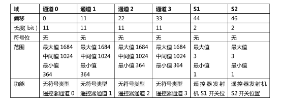
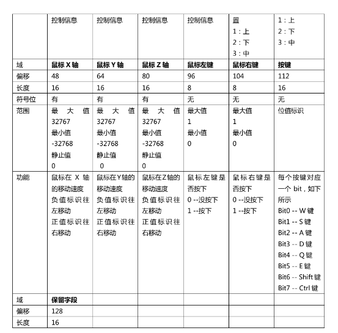

# remote_control
## 手册




## .c函数
 ```c
@brief 摇杆绝对值超过660的置0
static void RectifyRCjoystick()
{
    for (uint8_t i = 0; i < 5; ++i)
        if (abs(*(&rc_ctrl[TEMP].rc.rocker_left_x + i)) > 660)
*(&rc_ctrl[TEMP].rc.rocker_left_x + i) = 0;
}
```
```c
 @brief 遥控器数据解析
 @param sbus_buf 接收buffer
static void sbus_to_rc(const uint8_t *sbus_buf)
{
    /*
    摇杆,直接解算时减去偏置，将原来的通道0-通道3的中间值1024变成0
    四个通道的数据长度都为11位 一个sbus_buf数组里的元素长度为8位，而我们解析后需要用到数据是16位，我们要将sbus_buf[1]左移到sbus_buf[0]前，即左移8位，并做一个位或运算，这样就能将两个数据进行合并了，将合并后的数据和0x07ff即0b0000 0111 1111 1111做位与运算就能得到后11位的数据。
    */
    rc_ctrl[TEMP].rc.rocker_right_x = ((sbus_buf[0] | (sbus_buf[1] << 8)) & 0x07ff) - RC_CH_VALUE_OFFSET;

    //sbus_buf[1]后三位数据已经用在了前面的right_x，所以我们要先将sbus_buf[1]右移，让第四位变成第一位。因为sbus_buf[1]已经右移了3位，所以此时sbus_buf[2]只用左移(8-3)位就行了
    rc_ctrl[TEMP].rc.rocker_right_y = (((sbus_buf[1] >> 3) | (sbus_buf[2] << 5)) & 0x07ff) - RC_CH_VALUE_OFFSET;
    //sbus_buf[2]后6位数据已经用在了前面的right_y，所以我们要将sbus_buf[2]右移，让第7位变成第1位。因为sbus_buf[2]已经右移了6位，所以此时sbus_buf[2]只用左移(8-6)位就行了，此时数据长度为8+2=10，但是要11位，只能让sbus_buf[4]左移（8+2=10）位到最前面。
    rc_ctrl[TEMP].rc.rocker_left_x = (((sbus_buf[2] >> 6) | (sbus_buf[3] << 2) | (sbus_buf[4] << 10)) & 0x07ff) - RC_CH_VALUE_OFFSET; 
    //sbus_buf[4]后1位数据已经用在了前面的left_x，所以我们要先将sbus_buf[4]右移1位，让第2位变成第1位。因为sbus_buf[4]已经右移了1位，所以此时sbus_buf[2]只用左移(8-1)位就行了
    rc_ctrl[TEMP].rc.rocker_left_y = (((sbus_buf[4] >> 1) | (sbus_buf[5] << 7)) & 0x07ff) - RC_CH_VALUE_OFFSET;
    //左右开关长度为2位，sbus_buf[5]后4位数据已经用在了前面的left_y，所以我们要先将sbus_buf[5]右移4位，让第5位变成第1位。此时和0x0003即0b0000 0000 0000 0011做位与运算就能得到后2位的数据。此时和0x000C即0b0000 0000 0000 1100做位与运算就能得到第三、四位的数据。并将他右移到1、2位
    rc_ctrl[TEMP].rc.switch_right = ((sbus_buf[5] >> 4) & 0x0003);    

    rc_ctrl[TEMP].rc.switch_left = ((sbus_buf[5] >> 4) & 0x000C) >> 2; 

    //鼠标x、y长度为16位，sbus_buf[5]中的数据已经用完了，所以我们从sbus[6]开始，将sbus_buf[6]和sbus_buf[7]合并为mouse.x、将sbus_buf[8]和sbus_buf[9]合并为mouse.y
    rc_ctrl[TEMP].mouse.x = (sbus_buf[6] | (sbus_buf[7] << 8)); 
    rc_ctrl[TEMP].mouse.y = (sbus_buf[8] | (sbus_buf[9] << 8));
    //此处用不到mouse.z,sbus_buf[10]和sbus_buf[11]没有用，所以直接跳过
    // press_l、r键长度为8位，直接等于sbus_buf[12]和sbus_buf[13]就可以了
    rc_ctrl[TEMP].mouse.press_l = sbus_buf[12];                 
    rc_ctrl[TEMP].mouse.press_r = sbus_buf[13];
    //  key长度为16位，直接将sbus_buf[14]与sbus_buf[15]合并就可以了
    (uint16_t )&rc_ctrl[TEMP].key[KEY_PRESS] = (uint16_t)(sbus_buf[14] | (sbus_buf[15] << 8));
    //保留字段用于拨轮，长度为11位，直接将sbus_buf[16]与sbus_buf[17]合并后和0x07ff即0b0000 0111 1111 1111做位与运算就能得到后11位的数据。
    rc_ctrl[TEMP].rc.dial = ((sbus_buf[16] | (sbus_buf[17] << 8)) & 0x07FF) - RC_CH_VALUE_OFFSET;// 左侧拨轮
   //把通道值的绝对值＞660的滤掉
    RectifyRCjoystick();

    // ctrl键按下
    if (rc_ctrl[TEMP].key[KEY_PRESS].ctrl) 
        rc_ctrl[TEMP].key[KEY_PRESS_WITH_CTRL] = rc_ctrl[TEMP].key[KEY_PRESS];
    else
        memset(&rc_ctrl[TEMP].key[KEY_PRESS_WITH_CTRL], 0, sizeof(Key_t));
    // shift键按下
    if (rc_ctrl[TEMP].key[KEY_PRESS].shift) 
        rc_ctrl[TEMP].key[KEY_PRESS_WITH_SHIFT] = rc_ctrl[TEMP].key[KEY_PRESS];
    else
        memset(&rc_ctrl[TEMP].key[KEY_PRESS_WITH_SHIFT], 0, sizeof(Key_t));

    uint16_t key_now = rc_ctrl[TEMP].key[KEY_PRESS].keys,                   // 当前按键是否按下
        key_last = rc_ctrl[LAST].key[KEY_PRESS].keys,                       // 上一次按键是否按下
        key_with_ctrl = rc_ctrl[TEMP].key[KEY_PRESS_WITH_CTRL].keys,        // 当前ctrl组合键是否按下
        key_with_shift = rc_ctrl[TEMP].key[KEY_PRESS_WITH_SHIFT].keys,      //  当前shift组合键是否按下
        key_last_with_ctrl = rc_ctrl[LAST].key[KEY_PRESS_WITH_CTRL].keys,   // 上一次ctrl组合键是否按下
        key_last_with_shift = rc_ctrl[LAST].key[KEY_PRESS_WITH_SHIFT].keys; // 上一次shift组合键是否按下

    for (uint16_t i = 0, j = 0x1; i < 16; j <<= 1, i++)
    {
        if (i == 4 || i == 5) // 4,5位为ctrl和shift,直接跳过
            continue;
        // 如果当前按键按下,上一次按键没有按下,且ctrl和shift组合键没有按下,则按键按下计数加1(检测到上升沿)
        if ((key_now & j) && !(key_last & j) && !(key_with_ctrl & j) && !(key_with_shift & j))
            rc_ctrl[TEMP].key_count[KEY_PRESS][i]++;
        // 当前ctrl组合键按下,上一次ctrl组合键没有按下,则ctrl组合键按下计数加1(检测到上升沿)
        if ((key_with_ctrl & j) && !(key_last_with_ctrl & j))
            rc_ctrl[TEMP].key_count[KEY_PRESS_WITH_CTRL][i]++;
        // 当前shift组合键按下,上一次shift组合键没有按下,则shift组合键按下计数加1(检测到上升沿)
        if ((key_with_shift & j) && !(key_last_with_shift & j))
            rc_ctrl[TEMP].key_count[KEY_PRESS_WITH_SHIFT][i]++;
    }

    memcpy(&rc_ctrl[LAST], &rc_ctrl[TEMP], sizeof(RC_ctrl_t)); // 保存上一次的数据,用于按键持续按下和切换的判断
}
```
```c
static void RemoteControlRxCallback()
{
    // DaemonReload(rc_daemon_instance);         // 先喂狗
    sbus_to_rc(rc_usart_instance->recv_buff); // 进行协议解析
}
```

``` c
/**
 * @brief 串口掉线时调用
 *
 */
static void RCLostCallback(void *id)
{
    memset(rc_ctrl, 0, sizeof(rc_ctrl)); // 清空遥控器数据
    USARTServiceInit(rc_usart_instance); // 尝试重新启动接收
}
```
```c
/**
 * @brief 初始化遥控器,该函数会将遥控器注册到串口
 * @attention 注意分配正确的串口硬件,遥控器在C板上使用USART3，喵板用到的是USART5
 */
RC_ctrl_t *RemoteControlInit(UART_HandleTypeDef *rc_usart_handle)
{
    USART_Init_Config_s conf;
    conf.module_callback = RemoteControlRxCallback;
    conf.usart_handle = rc_usart_handle;
    conf.recv_buff_size = REMOTE_CONTROL_FRAME_SIZE;
    rc_usart_instance = USARTRegister(&conf);

    // 进行守护进程的注册,用于定时检查遥控器是否正常工作
    Daemon_Init_Config_s daemon_conf = {
        .reload_count = 10, // 100ms未收到数据视为离线,遥控器的接收频率实际上是1000/14Hz(大约70Hz)
        .callback = RCLostCallback,
        .owner_id = NULL, // 只有1个遥控器,不需要owner_id
    };
    rc_daemon_instance = DaemonRegister(&daemon_conf);

    rc_init_flag = 1;
    return rc_ctrl;
}
```
```c
// 用于遥控器数据读取,遥控器数据是一个大小为2的数组
#define LAST 1
#define TEMP 0

// 获取按键操作
#define KEY_PRESS 0
#define KEY_STATE 1
#define KEY_PRESS_WITH_CTRL 1
#define KEY_PRESS_WITH_SHIFT 2

// 原始的接收值
#define RC_CH_VALUE_MIN ((uint16_t)364)
#define RC_CH_VALUE_OFFSET ((uint16_t)1024)
#define RC_CH_VALUE_MAX ((uint16_t)1684)

// 开关
#define RC_SW_UP ((uint16_t)1)   // 开关向上时的值
#define RC_SW_MID ((uint16_t)3)  // 开关中间时的值
#define RC_SW_DOWN ((uint16_t)2) // 开关向下时的值

// 三个判断开关状态的宏
#define switch_is_down(s) (s == RC_SW_DOWN)
#define switch_is_mid(s) (s == RC_SW_MID)
#define switch_is_up(s) (s == RC_SW_UP)

// 用于计算这个按键被按下了多少次
#define Key_W 0
#define Key_S 1
#define Key_D 2
#define Key_A 3
#define Key_Shift 4
#define Key_Ctrl 5
#define Key_Q 6
#define Key_E 7
#define Key_R 8
#define Key_F 9
#define Key_G 10
#define Key_Z 11
#define Key_X 12
#define Key_C 13
#define Key_V 14
#define Key_B 15

typedef union
{
    struct // 用于访问键盘状态
    {
        uint16_t w : 1;
        uint16_t s : 1;
        uint16_t d : 1;
        uint16_t a : 1;
        uint16_t shift : 1;
        uint16_t ctrl : 1;
        uint16_t q : 1;
        uint16_t e : 1;
        uint16_t r : 1;
        uint16_t f : 1;
        uint16_t g : 1;
        uint16_t z : 1;
        uint16_t x : 1;
        uint16_t c : 1;
        uint16_t v : 1;
        uint16_t b : 1;
    };
    uint16_t keys; // 用于memcpy而不需要进行强制类型转换
} Key_t;

typedef struct
{
    struct
    {
        int16_t rocker_left_x; // 左水平
        int16_t rocker_left_y; // 左竖直
        int16_t rocker_right_x; // 右水平
        int16_t rocker_right_y; // 右竖直
        int16_t dial;      // 侧边拨轮

        uint8_t switch_left;  // 左侧开关
        uint8_t switch_right; // 右侧开关
    } rc;
    struct
    {
        int16_t x;
        int16_t y;
        uint8_t press_l;
        uint8_t press_r;
    } mouse;

    Key_t key[3]; // 改为位域后的键盘索引,空间减少8倍,速度增加16~倍

    uint8_t key_count[3][16];
} RC_ctrl_t;
```